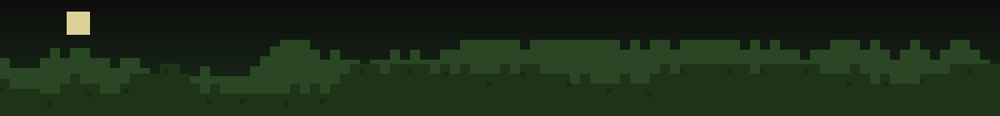

  

<table border="0">
<tr>
<td width="160" align="center" valign="middle">

</td>
<td valign="middle">

# `Folu Taiwo`

**Software Engineer** &nbsp;·&nbsp; Clemson University, CS '27

</td>
</tr>
</table>

 

 

<table width="100%" border="0">
<tr><td>

### `🧱 side quests`

</td></tr>
<tr><td>

> **Software Engineer Intern** @ Truist · Atlanta, GA &nbsp;|&nbsp; *May 2026 – Present*
> Automating AWS account audits and infrastructure hardening across 100+ accounts with Python, Lambda, and Terraform.

> **Previously:** AI Software Engineer (Contract) @ Handshake · *Feb – May 2026* — built and benchmarked 50+ LLM coding-eval prompts.
> **Secretary**, NSBE Clemson Chapter &nbsp;·&nbsp; ColorStack Fellow

</td></tr>
</table>

 

### `⛏️ inventory`

<table width="100%" border="0">
<tr>
<td align="center" width="25%">

**Languages**
  

</td>
<td align="center" width="25%">

**Frameworks**
  

</td>
<td align="center" width="25%">

**Infra**
  

</td>
<td align="center" width="25%">

**Tools**
  

</td>
</tr>
</table>

 

### `🏆 highlights`

<table width="100%" border="0">
<tr>
<td width="50%" valign="top">

**⚡ Speedrunner**
Cut a 5-hour manual AWS audit down to **under 2 minutes** across **114 accounts**

</td>
<td width="50%" valign="top">

**🛠️ Master Builder**
Automated infra hardening on **100+** tagged EC2 instances via Terraform + SSM

</td>
</tr>
<tr>
<td width="50%" valign="top">

**🤖 Diamond Hands**
Shipped **50+** prompt benchmarks for LLM code-gen evaluation at Handshake

</td>
<td width="50%" valign="top">

**🐛 Bug Hunter**
Logged **100+** critical bugs across **900+** test cases at Eleos Technologies

</td>
</tr>
</table>

 

### `🐍 contributions`

<picture>
  <source media="(prefers-color-scheme: dark)" srcset="https://raw.githubusercontent.com/mtaiwo1/mtaiwo1/output/github-snake-dark.svg" />
  <source media="(prefers-color-scheme: light)" srcset="https://raw.githubusercontent.com/mtaiwo1/mtaiwo1/output/github-snake.svg" />
  
</picture>

 

  

 

